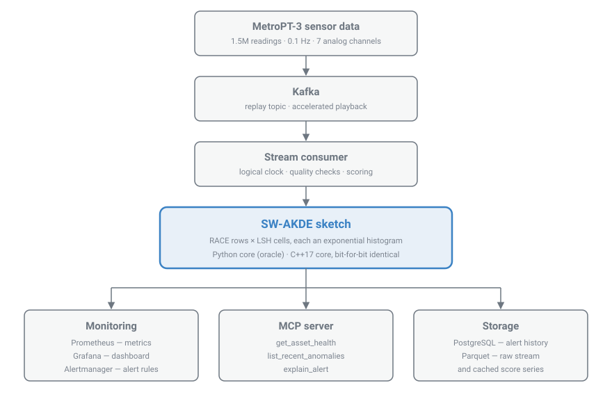
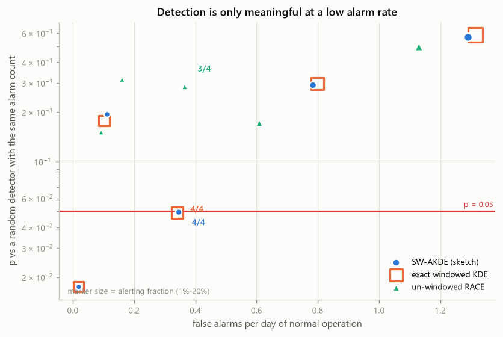
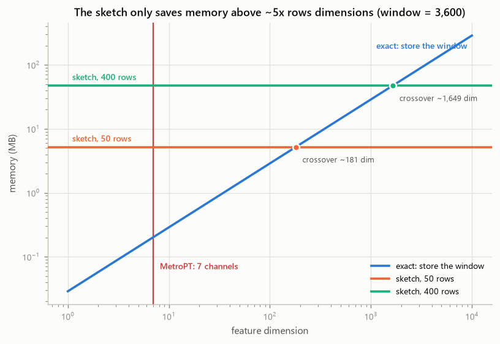

# Real-Time Streaming Anomaly & Data-Quality Monitor

[](https://github.com/vaishnavi1064/sliding-window-kde-monitor/actions/workflows/ci.yml)

A streaming anomaly and data-quality monitor for industrial equipment sensors, built on a
**sliding-window Approximate Kernel Density Estimation (SW-AKDE) sketch** with a C++17 hot
path, a Kafka → Prometheus/Grafana pipeline, and an MCP server that exposes asset health to
AI agents.

**Scale, stated up front:** single node, single asset, **0.1 Hz**, 1.5M readings. This is a
corrected implementation and an applicability study of a 2025 algorithm — not a distributed
system, and not new research ([what this is, and is not](#what-this-is-and-is-not)).

## At a glance

| | Result | Source |
|---|---|---|
| **Native core** | C++17 behind pybind11: **~10–20x** faster updates, ~6–14x queries, **2.2x** smaller — and **bit-for-bit identical** to the Python oracle, enforced on CI across gcc and MSVC | [PERFORMANCE.md](docs/PERFORMANCE.md) |
| **Pipeline speed** | One full 1,516,948-reading MetroPT-3 pass: **23.9 min → 1.1 min** (~20x) | [PERFORMANCE.md](docs/PERFORMANCE.md) |
| **Correctness** | Auditing the paper and its reference implementation turned up **seven** real defects — two of them in the *published algorithm*. All fixed here, each pinned by a test | [PROJECT_RECORD.md §4](docs/PROJECT_RECORD.md) |
| **Detection** | All four documented failures at a 5% alarm budget: **p = 0.004** at a 3-hour horizon, **p = 0.050** at 24 hours, against a matched-budget random control. Loosen the budget to the Phase-2 operating threshold (16.9% alerting) and it falls to chance, p = 0.499. The sketch matches exact windowed KDE to within noise at every horizon | [EVALUATION.md](docs/EVALUATION.md) |
| **The finding** | At seven channels the sketch costs **26–236x more memory than simply storing the window**. The crossover is `dim > ~5 x rows` on the Python core and `~2.3 x rows` with the C++ core — either way this application sits outside the regime where the algorithm pays off. We report the boundary rather than engineer around it | [EVALUATION.md §4](docs/EVALUATION.md) |
| **Tests** | **130 green** on CI (Linux/gcc and Windows/MSVC), 93 + 37 skipped in the no-compiler job | [PROJECT_RECORD.md §3.7](docs/PROJECT_RECORD.md) |

## Architecture



*Docker Compose packages the stack, GitHub Actions runs CI on every push, and MLflow tracks
evaluation runs.*

## Quick start

The sketch itself needs only numpy, so a fresh clone runs its full validation suite in seconds:

```bash
py -3.12 -m venv .venv                               # .venv/bin/python on Linux/macOS
.venv/Scripts/python.exe -m pip install -e ".[dev]"
.venv/Scripts/python.exe -m pytest                   # 93 passed, 37 skipped (no native core)
```

Then add the optimized core, or bring up the whole monitoring stack:

```bash
make native   # compile the C++17 core (needs a C++17 compiler); pytest is then 130 passed
make up       # Kafka + consumer + Prometheus + Grafana + Alertmanager + Postgres
```

Full instructions — the dataset, the MCP server, and a `make`-free equivalent for every
target — are under [Running it](#running-it).

## What this is (and is not)

The SW-AKDE algorithm is **not ours**. It comes from Danait, Das & Bhore,
*Sublinear Sketches for Approximate Nearest Neighbor and Kernel Density Estimation*
([arXiv:2510.23039](https://arxiv.org/abs/2510.23039), Oct 2025), which composes two known
pieces — RACE (Coleman & Shrivastava, WWW 2020) and Exponential Histograms (Datar, Gionis,
Indyk & Motwani, 2002) — to give RACE sliding-window semantics. That research contribution is
theirs.

**Our contribution is the engineering and the application:**

1. **Engineering** — the authors' reference implementation is an unoptimized research
   prototype. We re-implement the sketch cleanly, with tests, validated against
   sketch-independent ground truth, plus an optimized C++17 core that is ~10–20x faster on
   updates (~6–14x on queries) than *that already-vectorized Python implementation* — not
   than a naive one — and bit-for-bit identical to it.
2. **Application** — the paper never applies this to industrial-sensor anomaly detection.
   We do, against a real dataset with documented ground-truth failures, and the honest
   result is that this workload sits on the wrong side of the algorithm's memory crossover.

We do not claim a new algorithm.

## Status

| Phase | Scope | State |
|---|---|---|
| 0 | Repo, reference audit | Done |
| 1 | Validated pure-Python sketch (angular kernel) | Done |
| 1.5 | Euclidean kernel; profiling + 2.9x vectorization | Done |
| 2 | Kafka streaming, Prometheus/Grafana/Alertmanager | Done — alert verified firing end to end |
| 3 | Anomaly detector + MetroPT evaluation | Done |
| 4 | MCP server | Done — three tools verified end to end |
| 5 | C++17 + pybind11 optimized core | Done — ~10–20x on updates over the optimized Python core, bitwise-identical |
| 6 | Adaptive window size (research extension) | Stretch |

130 tests green, on CI as well as locally: 130 pass in each native-core job (Linux/gcc and
Windows/MSVC) and 93 pass with 37 skipped in the job that installs no native core.

| Document | What is in it |
|---|---|
| [`docs/PERFORMANCE.md`](docs/PERFORMANCE.md) | Engineering log: profiles, throughput, the native core, verification state |
| [`docs/EVALUATION.md`](docs/EVALUATION.md) | Evaluation methodology, detection results, the memory boundary |
| [`docs/PROJECT_RECORD.md`](docs/PROJECT_RECORD.md) | Every verified number with its source, the seven findings, and what is *not* claimed |
| [`docs/REFERENCE_NOTES.md`](docs/REFERENCE_NOTES.md) | Line-level audit of the authors' reference implementation |
| [`docs/DATA_NOTES.md`](docs/DATA_NOTES.md) | What the real data contradicted, and what it forced in the code |

## Results

### 1. The native core

C++17 behind pybind11, selected with `backend="native"`. The port was aimed by measurement
rather than assumption: profiling put ~72% of update time in the exponential histogram and
none in the hashing (already a matmul), so C++ owns the cell array and NumPy keeps the hashing.

Synthetic stream, `dim=15`, `k=5`, `window=256`; the Python column is re-measured in the same
run, so each ratio is internally consistent (`make bench-native`):

| rows | Python upd/s | native upd/s | speedup | native p50 | native p99 | hash share |
|---:|---:|---:|---:|---:|---:|---:|
| 100 | 9,741 | 100,054 | **10.3x** | 9.2 µs | 14.7 µs | 45.2% |
| 200 | 4,574 | 55,853 | **12.2x** | 16.1 µs | 27.2 µs | 35.3% |
| 400 | 2,009 | 27,887 | **13.9x** | 32.8 µs | 92.0 µs | 27.9% |
| 800 | 688 | 13,079 | **19.0x** | 69.9 µs | 130.6 µs | 22.0% |
| 1600 | 308 | 5,617 | **18.3x** | 159.2 µs | 346.3 µs | 17.4% |
| 3200 | 113 | 1,867 | **16.6x** | 457.6 µs | 923.6 µs | 15.1% |

On real MetroPT-3 readings at the settings the pipeline actually runs (`rows=400`, `k=3`,
`window=3600`, 150,000 readings):

| core | cells | cell memory | RSS delta | bytes/cell | upd/s | full 1.5M pass |
|---|---:|---:|---:|---:|---:|---:|
| Python | 83,920 | 63.9 MB | 113.9 MB | 761 | 1,060 | 23.9 min |
| native | 83,920 | 29.0 MB | 54.8 MB | 345 | 22,659 | **1.1 min** |
| | identical | **2.2x smaller** | **2.1x smaller** | | **21.4x** | |

The cell counts being **identical** is the point of that table: a memory win from holding fewer
cells would be a semantic difference, not an engineering one. Four things keep the rest of it
honest, all detailed in [`docs/PERFORMANCE.md`](docs/PERFORMANCE.md):

- **The speedup is quoted against our own optimized Python core.** Phase 1.5's 2.9x
  vectorization is *not* folded in. The two multiply to ~30–55x against the original scalar
  implementation, but that is not what this table reports.
- **Timed figures move between runs.** An earlier run of the same script gave 10.9–22.1x on
  updates; per-row ratios shift by up to ~3x on a non-isolated desktop. The defensible claim
  is **~10–20x on updates and ~6–14x on queries**, not any single cell. The *structural*
  memory figures reproduced exactly, to the byte.
- **"Hash share" is the ceiling.** It is the fraction of native update time still spent in
  the Python hash bank that both cores share — 45% at `rows=100`. Getting past ~20x means
  porting the hashing too, and only then.
- **The p99 tail was checked, not assumed.** The obvious culprit — the once-per-window
  compaction sweep — is wrong: removing compaction moves p99 by 5% in the *opposite*
  direction. It is ordinary scheduling jitter, and compaction really is O(1) amortised.

Parity with the Python oracle is asserted as bit-for-bit equality, not a tolerance; see
[Correctness](#correctness).

### 2. Detection quality

Full details in [`docs/EVALUATION.md`](docs/EVALUATION.md). With only four documented
failures, precision and recall are not reported — one event either way moves recall by 25%.
Every operating point is instead calibrated against a null that places the *same number of
alarms* at random, 2,000 times over, because with a 24-hour horizon a detector that alarms
about once a day catches everything by construction.

**The sketch works, and matches exact windowed KDE to within noise.** At equal alarm
budgets, SW-AKDE and brute-force exact KDE agree at every operating point and at every
horizon. Un-windowed RACE is genuinely worse — 3/4 rather than 4/4, everywhere — so
sliding-window semantics do buy something real. Each method thresholded at its own 5%
quantile, so all three carry the same alarm budget (`make evaluate`):

| horizon | SW-AKDE | exact windowed KDE | un-windowed RACE |
|---|---|---|---|
| 3h | 4/4, **p = 0.004** | 4/4, p = 0.004 | 3/4, p = 0.058 |
| 6h | 4/4, **p = 0.009** | 4/4, p = 0.009 | 3/4, p = 0.090 |
| 12h | 4/4, **p = 0.025** | 4/4, p = 0.024 | 3/4, p = 0.146 |
| 24h | 4/4, **p = 0.050** | 4/4, p = 0.049 | 3/4, p = 0.284 |
| 48h | 4/4, p = 0.150 | 4/4, p = 0.135 | 3/4, p = 0.545 |

The two left-hand columns never differ by more than 0.015, which is the positive result for
the engineering lever: **approximation costs essentially nothing in detection quality.**



**It detects at onset, but does not predict.** All four documented failures are found at
a 3-hour horizon with p = 0.004 — clearly better than chance — but with lead times of
about zero (mean −0.6h). The large positive leads at wider horizons (+10.1h at 24h) vanish
at 3h, meaning they were the wider window catching unrelated alarms rather than genuine
early warning. Two of the four failures have almost no signature in these sensors
beforehand (+0.62σ and +0.24σ), so no density-based detector could predict them.

**And it is only significant on a tight alarm budget.** Every p-value above is measured at
a 5% budget. The threshold actually fixed in Phase 2 — 1.30, chosen from synthetic-fault
tuning before these failures were examined — alerts **16.9%** of the time: it still finds
4/4, but chance alone finds 3.38/4, so **p = 0.499**. Detection here is real but narrow,
and it is bounded by the horizon *and* the budget together. Two caveats belong with that:
the table scans 5 horizons x 5 budgets, so p = 0.004 is the best cell of an exploratory
sweep rather than a pre-registered result, and strict Bonferroni over 25 cells
(α = 0.002) would not pass.

### 3. The finding: at seven channels the sketch costs more memory than the window it replaces

**At seven channels, the sketch costs 26–236x more memory than simply storing the
window** — and this is the contribution. Its footprint is independent of dimension while
exact storage grows with it, so there is a crossover, measured here at roughly

> `dim > 5 x rows`

on the Python core, or `dim > ~2.3 x rows` on the leaner C++ one — the boundary is linear in
bytes-per-cell, so a 2.2x cheaper cell moves it by that factor and no further. Seven channels
sits two orders of magnitude below either.



The 26–236x multiples are **near-trough samples**: compaction sweeps once per window, so the
live cell count sawtooths roughly 2x within each cycle and these figures are sampled near the
low point. On a peak basis `rows=400` is closer to **~385x** — which is itself a single observed
sample 3,000 ticks into one cycle, **not a proven maximum**, since `memory_check` does not track
a running high-water mark. That makes the negative result stronger, not weaker; see
[`docs/PROJECT_RECORD.md`](docs/PROJECT_RECORD.md) §9.1.

Exact windowed KDE needs 0.20 MB for MetroPT; the sketch needs 5–48 MB for the same
detection quality. Because accuracy demands rows and memory is linear in rows, **the
dimension required to justify the sketch grows with the accuracy you want** — a tension
the source paper does not discuss. Its own experiments used 103-, 200- and
384-dimensional data, comfortably inside the useful regime; a seven-channel sensor feed
is two orders of magnitude outside it.

So for MetroPT specifically we would recommend exact windowed KDE over our own sketch.
We report that boundary rather than engineering around it: knowing where the line sits,
measured, is more useful than a demonstration that avoided the question.

## Correctness

We validate bottom-up against ground truth that involves no sketch at all, never against the
reference implementation's outputs — because auditing that implementation turned up **seven** real
defects, documented with evidence in [`docs/REFERENCE_NOTES.md`](docs/REFERENCE_NOTES.md) and
enumerated in full in [`docs/PROJECT_RECORD.md`](docs/PROJECT_RECORD.md) §4. Two of them trace back
to the paper's own pseudocode rather than just the code.

| | Defect | Where it lives | Active at the paper's own setting? |
|---|---|---|---|
| **A** | Every cell silently drops its first arrival | **Algorithm 2** and `Ang_hash_AKDE.py` 25-28 | **Yes** |
| **F** | Cold cells never expire, so their density is frozen forever | **Algorithm 2** and `Exponential_Histogram.py` 56-57 | **Yes** |
| **B** | Single-step expiry under-evicts — `total` drifts to **4x** the true count on a long-gap sequence | `Exponential_Histogram.py` 27 | Yes |
| — | Window-boundary off-by-one: `<` keeps `N+1` elements where Problem 1.2 defines `N` | `Exponential_Histogram.py` 27 | Yes |
| **E** | Angular cell code encodes only Hamming weight, losing *which* hashes fired | `Ang_hash_AKDE.py`, `RACE_19.py` | No — latent, bites at `k > 1` |
| **G** | Euclidean cell code sums the `k` hashes, collapsing 4,000 points into 101 cells | `L2_hash_AKDE.py` 30-33 | No — latent |
| **H** | The L2 brute-force ground truth omits `** k` | `window_size.py` 27-37 and copies | No — latent |

That is 2 + 3 + 2 = **seven**. Findings C and D from the audit are deliberately not counted: C is
the reference being *correct* (the paper does specify the mean for SW-AKDE), and D is our
validation strategy rather than a defect in the source material.

**The two in the published algorithm.** Both are in Algorithm 2 of arXiv:2510.23039 (§4.1), and
both are active at the concatenation setting the paper uses for all its experiments (`k = 1` in
our notation; the paper calls it `p`):

- **Finding A — every cell silently drops its first arrival.** Algorithm 2's
  preprocessing loop reads `if A[i,j] is empty then Create an Exponential Histogram …
  else Add a 1 …`: the create branch has no corresponding "Add a 1", so the element that
  created the cell is never counted. The reference repeats it
  (`Ang_hash_AKDE.py` lines 25-28).
  Test: [`test_every_cells_first_arrival_is_counted`](tests/test_sw_akde_windowed.py) —
  one element gives density 1.0 correctly and exactly 0.0 under the published branch
  structure. The tier-2 convergence test cannot see this (a one-per-cell undercount
  measures 0.074 vs 0.063 mean relative error, both inside its 0.30 tolerance), which is
  why it is tested separately.
- **Finding F — cells that stop receiving data never expire, so their density is frozen
  forever.** Algorithm 2's query procedure reads
  `c ← estimate of count in the Exponential Histogram at A[i, h_i(q)]` — no time
  argument, so it cannot expire before reading; the reference's `count_est()` likewise
  takes no timestamp. This is the one that matters most here: a region going quiet *is*
  the anomaly signal, and without expiry-on-read that density never decays.
  Test: [`test_window_actually_expires_old_data`](tests/test_sw_akde_windowed.py) —
  density falls to 0.00 of its fresh value with expiry-on-read and stays at 1.00
  (unchanged) when the published read path is reproduced, failing the assert.
  The same lazy expiry also leaks memory, quantified in
  [`docs/PERFORMANCE.md`](docs/PERFORMANCE.md).

**The three that are latent.** E, G and H are code-only defects, and the paper sets the
concatenation parameter to 1 for all experiments — at which all three are inert. They break only
at `k > 1`, the regime the LSH-amplification argument is actually about. We fixed them because we
intend to use `k > 1`. **The paper's published numbers stand**, and we make no claim otherwise.

The distinction matters and we keep it throughout: A and F are corrections to the
*published algorithm* at its own settings; E, G and H are bugs in the *reference code*
that its own experiments never triggered. We have not attempted to quantify what A and F
would change in the paper's reported figures, and so we do not assert anything about them.

The three validation tiers (see `CLAUDE.md` §9) are: exponential-histogram unit correctness;
un-windowed parity against plain RACE and full-stream brute force; and windowed accuracy
against brute-force last-N KDE within the paper's own theoretical bound.

The C++ core adds a fourth check. It is not held to a tolerance but to **bit-for-bit equality**
with the Python core — identical query output, and identical per-cell state down to bucket
timestamps and sizes ([`tests/test_native_parity.py`](tests/test_native_parity.py)). Both cores sum
exactly representable doubles in the same order, so there is no floating-point reordering to excuse
a difference, and a percentage tolerance would hide the off-by-one errors a reimplementation of a
merge cascade actually produces. The Python core stays the default and the oracle; CI runs one job
with the native core absent and one with it required, on Linux and Windows.

That parity is verified on CI, not just locally: all 37 parity tests execute and pass in both
native-core jobs (gcc 13.3.0 and MSVC 1951) and skip in the pure-Python job. See "Verification
state" in [`docs/PERFORMANCE.md`](docs/PERFORMANCE.md) for exactly what is and is not established.

## Running it

The sketch on its own needs only numpy:

```bash
py -3.12 -m venv .venv
.venv/Scripts/python.exe -m pip install -e ".[dev]"
.venv/Scripts/python.exe -m pytest
```

### The native core (optional)

Everything above passes without it, and `backend="python"` remains the default. To build and
benchmark the C++17 core:

```bash
make native        # compile it in place (needs a C++17 compiler)
make bench-native  # native vs Python: throughput, latency, memory
```

Needs the Visual Studio C++ Build Tools on Windows or g++/clang elsewhere;
`scripts/build_native.py` locates the MSVC environment itself. The streaming stack picks the
native core up automatically (`SKETCH_BACKEND=auto`) and the consumer logs which core it resolved.

### The monitoring stack

```bash
make env      # copy .env.example to .env, then edit the placeholders
make data     # download MetroPT-3 and convert to Parquet (~208 MB, not committed)
make up       # Kafka, consumer, Prometheus, Grafana, Alertmanager, Postgres
make anomaly  # replay the stream with a synthetic fault injected
```

`.env` holds the local Postgres and Grafana credentials and is **not committed** —
only [`.env.example`](.env.example) is. Nothing has a hardcoded password: compose
refuses to start without the variables set, and the Python entry points raise a
message naming `.env.example` rather than falling back to a guess.

Grafana on <http://localhost:3000> (anonymous access), Prometheus on `:9090`,
Alertmanager on `:9093`. `make down` stops everything.

### Agent access (MCP)

```bash
make alerts      # load detected episodes into Postgres
make mcp-verify  # exercise the three MCP tools end to end
make mcp-serve   # run the MCP server on stdio
```

### Without `make`

Every target is a thin wrapper around one or two commands, so nothing here needs `make`
installed — useful on a clean Windows clone, where it usually isn't. `$PY` below is the venv
interpreter: `.venv/Scripts/python.exe` on Windows, `.venv/bin/python` on Linux and macOS.
(The Makefile hardcodes the Windows path.)

| `make` target | Direct equivalent |
|---|---|
| `env` | `cp .env.example .env` |
| `venv` | `py -3.12 -m venv .venv && $PY -m pip install -e ".[dev,streaming]"` |
| `native` | `$PY -m pip install "pybind11>=2.13" "setuptools>=68" && $PY -m scripts.build_native` |
| `test` | `$PY -m pytest -v` |
| `bench` | `$PY -m scripts.benchmark` |
| `bench-native` | `$PY -m scripts.benchmark_native` |
| `tune` | `$PY -m scripts.tune_detector` |
| `memcheck` | `$PY -m scripts.memory_check` |
| `memcheck-rows` | `$PY -m scripts.memory_check --records 150000 --rows-sweep` |
| `memcheck-crossover` | `$PY -m scripts.memory_check --records 120000 --crossover` |
| `evaluate` | `$PY -m scripts.run_evaluation --method swakde` (then `race`, `exact`), followed by `$PY -m scripts.compare_methods`, `.horizon_sensitivity`, `.diagnose_failures` |
| `figures` | `$PY -m scripts.make_plots` |
| `mlflow` | `$PY -m scripts.log_to_mlflow` |
| `data` | `$PY -m scripts.download_data` |
| `alerts` | `docker compose up -d postgres && $PY -m scripts.load_alerts` |
| `mcp-verify` | `$PY -m scripts.verify_mcp` |
| `mcp-serve` | `$PY -m mcp_server.server` |
| `up` | `docker compose up -d --build` |
| `replay` | `docker compose --profile replay run --rm producer python -m streaming.producer --bootstrap kafka:9094` |
| `anomaly` | as `replay`, plus `--speedup 60 --max-records 26000 --inject-anomaly-at 14000 --inject-duration 12000 --inject-scale 4` |
| `logs` | `docker compose logs -f consumer` |
| `down` | `docker compose down` |

The targets that read `.env` (`alerts`, `mcp-verify`, `mcp-serve`) rely on the Makefile exporting
it first; run them with the variables already in your environment, or export `.env` yourself.

Two Phase 5 verification modes have no `make` target and are invoked directly:

```bash
$PY -m scripts.benchmark_native --tail-check                      # p99 tail attribution
$PY -m scripts.benchmark_native --eval-parity --records 30000     # both cores, real data
```

## Layout

```
sketch/     the sketch itself: exponential histogram, LSH, SW-AKDE, RACE baseline, brute-force oracle
src/        the C++17 core behind the same interface (Phase 5), built by setup.py
streaming/  producer, consumer, feature extraction, data-quality checks, scoring
docker/     Dockerfile and the Prometheus / Grafana / Alertmanager configuration
scripts/    dataset download, throughput benchmarks, native build driver
tests/      the three validation tiers, native parity, plus streaming component tests
docs/       reference audit, performance log, evaluation, project record, and the source paper
CLAUDE.md   full project brief: novelty framing, findings, build plan, tech-stack rationale
```

## Data

MetroPT-3 (UCI): metro-train Air Production Unit sensors, 1,516,948 readings over
Feb–Sep 2020, 15 sensor channels, with four documented air-leak failures in a separate
maintenance report. The dataset is **not committed** — run `make data`.

Two things measurement contradicted, both detailed in
[`docs/DATA_NOTES.md`](docs/DATA_NOTES.md): the sampling rate is **0.1 Hz (every 10s), not
1 Hz** as the documentation says, and normal density is hugely variable because the
compressor cycles — enough that a naive z-score misses a 9x density collapse entirely.

## References

1. Danait, Das, Bhore. *Sublinear Sketches for ANN and KDE.* arXiv:2510.23039, 2025.
2. Coleman & Shrivastava. *Sub-linear RACE sketches for A-KDE on streaming data.* WWW 2020.
3. Datar, Gionis, Indyk, Motwani. *Maintaining stream statistics over sliding windows.*
   SIAM J. Comput., 2002.
4. Veloso et al. *The MetroPT dataset for predictive maintenance.* Scientific Data, 2022.
