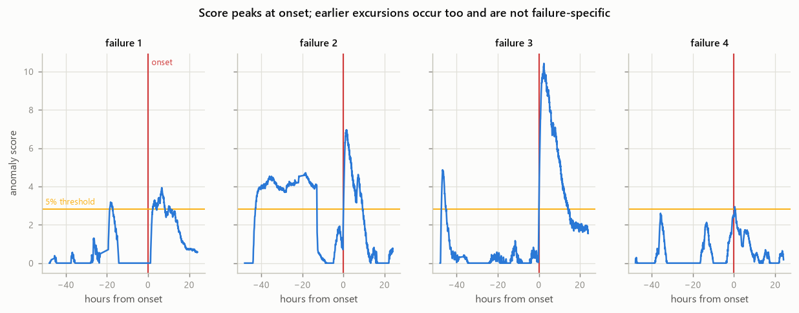
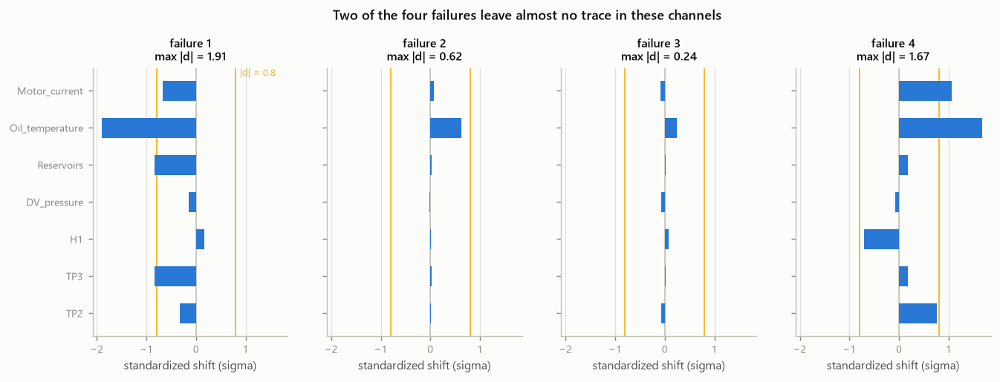

# Evaluation methodology

How the detector is judged against MetroPT-3, and why it is judged that way.
Results are produced by `scripts/run_evaluation.py` and `scripts/compare_methods.py`.

## The core difficulty: four positives

MetroPT-3 documents exactly **four** air-leak failures, in a maintenance report
separate from the sensor data (there is no label column). Four is a very small
number of positives, and it shapes everything below.

**Precision and recall are not reported.** With four positives, one event either
way moves recall by 25%, and no confidence interval worth quoting can be placed
around either figure. Quoting "recall = 0.75" would imply a precision the data
cannot support. Papers do report such numbers on this dataset; we think that is
a mistake and decline to repeat it.

What four events *can* support:

| metric | why it survives n=4 |
|---|---|
| **per-event detection** | four separate yes/no answers, each individually meaningful |
| **detection lead time** | measured per event; the actual value proposition of predictive maintenance |
| **false-alarm rate** | denominated in *days of normal operation*, so it does not depend on the positive count at all |

## Prediction horizon

An alert that fires once a failure is already under way is close to worthless.
Each failure therefore gets a **24-hour horizon** before its recorded start, and
an alert inside that horizon counts as detecting it. Lead time is measured from
the failure's recorded start, so it is positive for genuine early warning and
negative for an alert raised mid-failure.

24 hours is a judgement call: long enough to credit real early warning on faults
that develop over hours, short enough not to swallow the timeline. It is a
parameter of the evaluation, not of the detector, and the sensitivity of results
to it should be reported rather than hidden.

## Alarms are episodes, not samples

A sustained fault puts thousands of consecutive samples above threshold.
Counting each as an alarm would make any false-alarm figure meaningless, so
consecutive alerting samples within an hour of each other collapse into one
**episode** — which is what an operator actually sees.

One consequence worth knowing when reading a sweep: because alarms are episodes,
the false-alarm rate is **not monotone** in the threshold. A low threshold can
merge a noisy stretch into a single long episode while a higher one fragments
the same stretch into several. Treat a sweep as a map of operating points, not a
monotone trade-off curve. (Detection counts *are* monotone.)

## Calibrating against luck — the control that matters most

This is the check that makes any detection claim meaningful, and it changed our
reading of the results completely.

With a 24-hour horizon around each failure, a detector that alarms roughly once
a day lands inside a horizon **most of the time by construction**. Catching all
four failures then says nothing whatsoever about the detector.

So every operating point is calibrated against a null: place the *same number of
alarms* uniformly at random across the same timeline, and count how many
failures that catches. Repeated 2,000 times, this gives

- **chance** — failures a random detector with the same alarm budget would catch
- **p** — the fraction of random trials matching or beating the real detector

A low p at a *small* alerting fraction is the only combination that demonstrates
genuine detection. A high detection count on its own does not.

Concretely, the un-windowed RACE baseline detects 4/4 failures at threshold 1.3
— but it is alerting **17.1% of the time**, chance alone catches 3.21/4, and
**p = 0.399**. Reported without the control, "detects all four failures with
17 hours of lead time" would have been badly misleading.

## Comparing methods fairly

Methods produce scores on different scales — un-windowed RACE's counts grow
without bound, so its score distribution is nothing like the sketch's. Comparing
them at a *fixed threshold* compares nothing.

`scripts/compare_methods.py` therefore selects each method's threshold as a
**quantile of its own score distribution**, so all methods are compared at the
same alerting fraction: the same alarm budget an operator would tolerate. That,
plus the chance calibration at each point, is the comparison.

## Baselines

| baseline | what it isolates |
|---|---|
| **un-windowed RACE** | what sliding-window semantics actually buy. Same LSH geometry, integer counters, nothing ever expires. This is the comparison the source paper itself makes. |
| **exact windowed KDE** | what bounded memory costs. Brute-force sum over the last N readings — the quantity the sketch approximates, with no sketch involved. Uses O(N·d) memory and O(N) work per query, precisely what the sketch exists to avoid, so it is a reference point rather than a deployable alternative. |

### TAKDE was considered and dropped

CLAUDE.md lists TAKDE (Wang, Ding & Shahrampour, TPAMI 2023) as a bonus
baseline. On reading the reference implementation
(`TAKDE/takde_alg.py`), it turns out to be a **one-dimensional synthetic
benchmark script**, not a reusable implementation:

- window selection bins with 1-D `np.histogram` over a scalar batch;
- ground truth is assumed to be a known Gaussian, `dst[t] = (mean, std)`;
- the relative error is computed inline, against that assumed truth;
- the query loop is a triple-nested Python loop over queries x window x batch.

Running it on 7-dimensional sensor data requires choosing a multivariate
two-sample statistic for the window-selection step, which the method's reference
does not provide. Any weakness in the result would then reflect *our* choice
rather than the published method, which makes the comparison indefensible rather
than informative. Dropping it, and saying so, is more honest than shipping a
"TAKDE" that is substantially ours. Revisiting it properly is a scoped piece of
work in its own right.

## Results

All figures from the full 1,516,948-reading replay, `rows=400`, `k=3`,
`window=3600`, seven analog channels.

### 1. The sketch matches exact windowed KDE almost exactly

Compared at equal alerting fractions:

| alerting | swakde events / p | exact events / p | race events / p |
|---|---|---|---|
| 20% | 4/4, p=0.567 | 4/4, p=0.585 | 4/4, p=0.495 |
| 10% | 4/4, p=0.290 | 4/4, p=0.296 | 4/4, p=0.172 |
| **5%** | **4/4, p=0.050** | **4/4, p=0.049** | 3/4, p=0.284 |
| 2% | 2/4, p=0.194 | 2/4, p=0.177 | 2/4, p=0.315 |
| 1% | 2/4, p=0.018 | 2/4, p=0.018 | 2/4, p=0.151 |


*Each marker is one alarm budget; the filled sketch markers sit inside the hollow
exact rings wherever the two agree. Numbers in
[`figures/operating_points.csv`](figures/operating_points.csv).*

SW-AKDE tracks exact KDE to within noise at every operating point — 0.050 versus
0.049 at the 5% budget. **Approximation costs essentially nothing in detection
quality**, which is the positive result for the engineering lever.

Un-windowed RACE is meaningfully worse where it matters: at the 5% budget it
finds 3/4 rather than 4/4, and its p-values never get close. Sliding-window
semantics do buy something real here, which supports the source paper's claim.

### 2. It detects at onset; it does not predict

The prediction horizon changes the story completely, so it has to be reported
rather than chosen. Every row below is at the **5% alarm budget**, each method
thresholded at its own 5% quantile (2.81 for SW-AKDE, 2.80 for exact), so the two
columns are directly comparable. Leads are SW-AKDE's; exact's differ only in the
last decimal (+27.2h against +27.1h at 48h, identical elsewhere).

| horizon | SW-AKDE | exact windowed KDE | SW-AKDE mean lead | SW-AKDE per-event lead |
|---|---|---|---|---|
| 3h | 4/4, **p = 0.004** | 4/4, p = 0.004 | −0.6h | −2, −0, −0, −0 |
| 6h | 4/4, p = 0.009 | 4/4, p = 0.009 | −0.6h | −2, −0, −0, −0 |
| 12h | 4/4, p = 0.025 | 4/4, p = 0.024 | −0.6h | −2, −0, −0, −0 |
| 24h | 4/4, p = 0.050 | 4/4, p = 0.049 | +10.1h | +19, +22, −0, −0 |
| 48h | 4/4, p = 0.150 | 4/4, p = 0.135 | +27.1h | +19, +43, +47, −0 |

*Correction (2026-09-05).* This table previously carried a single unlabelled `p`
column holding **exact windowed KDE's** values (0.004 / 0.009 / 0.024 / 0.049 /
0.135) while the surrounding prose attributed them to the sketch, and its 24h
cell (0.049) therefore contradicted §1's correctly-labelled swakde figure of
0.050. Both methods' numbers are now shown under their own headers, regenerated
from the same committed caches with `python -m scripts.horizon_sensitivity`.
Nothing moved: the chance calibration is seeded (`seed=0`, 2,000 trials) and
exact still reproduces its five p-values to the digit. The conclusion is
unchanged — the two methods agree to within 0.015 at every horizon, which is
precisely §1's finding.

At a tight 3-hour horizon the detector finds all four failures with p = 0.004 —
clearly better than chance. But the lead times are **≈0**: it fires *as* each
failure begins. The large positive leads only appear once the horizon is widened,
and they vanish at 3h, which means they are the wider window catching unrelated
alarms rather than genuine early warning.



*The score peaks at onset in all four cases. Note failure 2, which is also above
threshold from roughly -45h to -15h: earlier excursions do happen, they are just
not specific to failures, which is why the wide-horizon leads do not survive the
chance test. Numbers in
[`figures/scores_around_failures.csv`](figures/scores_around_failures.csv).*

**This is a detection system, not a prediction system, on this data.** The
"+10h mean lead" that a naive reading of the 24h row would support is not
supported once chance is accounted for. (This sentence previously said "+17h",
which matched no cell of the table above — 16.79h is the 20% budget's mean lead
in `figures/operating_points.csv`, not the 24h row's.)

Caveat: this table scans 5 horizons x 5 thresholds, so quoting the best cell is
multiple comparisons over four events. The low values cluster consistently at
tight horizons rather than appearing in one lucky cell, which is more
reassuring than a single p, but strict Bonferroni over 25 cells (α = 0.002)
would not pass.

### 3. Why detection is limited: half the failures are invisible in these channels

`scripts/diagnose_failures.py` measures each channel's standardized shift in the
24 hours before each failure, against normal operation:

| failure | largest analog effect | verdict |
|---|---|---|
| failure-1 | Oil_temperature −1.91σ | clearly visible |
| failure-2 | Oil_temperature +0.62σ | barely visible |
| failure-3 | Oil_temperature +0.24σ | not visible |
| failure-4 | Oil_temperature +1.67σ | clearly visible |



*Numbers in [`figures/effect_sizes.csv`](figures/effect_sizes.csv).*

Two of the four failures have essentially no analog signature beforehand. No
density-based detector on these channels can predict them, because the
information is not there.

The eight **digital** channels do shift (`Oil_level` 0.901 → 1.000,
`Caudal_impulses` 0.935 → 1.000, `DV_eletric` 0.143 → 0.024 or 0.393), so we
added their rolling duty cycles as features. **It made things worse** — best p
went from 0.108 to 0.193. Going from 7 to 15 dimensions diluted the density
estimate faster than the extra signal helped, which is the ordinary curse of
dimensionality for KDE. Reported as a failed attempt rather than quietly
dropped.

Honesty note: those duty-cycle features were chosen *after* inspecting the four
events. With n=4 that is a real overfitting risk, and it is one reason not to
keep iterating on feature selection here.

### 4. The uncomfortable one: at this dimensionality the sketch costs more memory than storing the window

The sketch exists so you never have to hold the window. But its footprint is
independent of dimension while exact storage grows with it, so there is a
crossover — and MetroPT sits on the wrong side of it.

Measured (`make memcheck-rows`), `window=3600`, `dim=7`:

| rows | live cells | sketch | vs exact | crossover dimension |
|---:|---:|---:|---:|---:|
| 50 | 7,398 | 5.2 MB | 26x | 179 |
| 100 | 15,383 | 12.0 MB | 60x | 418 |
| 200 | 29,849 | 23.6 MB | 117x | 819 |
| 400 | 60,330 | 47.5 MB | 236x | 1,650 |

Exact windowed KDE holds 3600 x 7 floats — **0.20 MB**. The sketch needs
5–48 MB for the same detection quality. On this workload it is **26–236x more
expensive than the thing it is supposed to replace** — and those are
**near-trough samples** of a compaction sawtooth, worse still on a peak basis.
See the Phase-5 caveat below the next table.


*The sketch's footprint is flat in dimension; storing the window is not. MetroPT
sits two orders of magnitude below either crossover. Numbers in
[`figures/memory_crossover.csv`](figures/memory_crossover.csv).*

#### The boundary, as a rule

Since this is the contribution rather than a footnote, it is worth stating
structurally. The sketch's footprint is

```
sketch_bytes = rows x cells_per_row x bytes_per_cell        (independent of dim)
exact_bytes  = window x dim x 8                             (linear in dim)
```

so the dimension at which they meet is

```
                 rows x cells_per_row(window) x bytes_per_cell
crossover_dim =  --------------------------------------------
                              window x 8
```

Two measured facts make this usable (`make memcheck-crossover`):

- **`bytes_per_cell` is constant**, ~590–800 bytes across every configuration —
  an exponential histogram plus its bucket objects.
  - **Caveat found later (Phase 5).** That range is not a constant so much as the
    span of a *sawtooth*. Compaction sweeps once per `window_size` ticks, so the
    live cell count roughly doubles between sweeps and collapses at each one.
    Measured at `rows=400`, `window=3600`: **58,421** cells / 46.8 MB / 802 B per
    cell immediately after a sweep, rising to **116,989** cells / 77.6 MB / 663 B
    per cell 3,000 ticks later, then collapsing again. The figures in the table
    above are sampled ~400 ticks after a sweep, i.e. **near the trough**, so they
    understate the footprint you must actually provision by roughly **1.6x**
    (77.6 vs 47.5 MB at `rows=400`). That makes the negative result *stronger*,
    not weaker: on a peak basis the `rows=400` sketch is closer to ~385x exact
    storage than the 236x quoted above. `bytes_per_cell` moves inversely to the
    cell count, which is why the crossover rule is less sensitive to this than
    the absolute megabytes are.
- **`cells_per_row` depends on the window, not on rows** — it is how many
  distinct LSH cells the window's points occupy, a property of the data. So
  crossover is *linear in rows*.

| window | cells/row | crossover / rows |
|---:|---:|---:|
| 900 | 80 | 6.7 |
| 1800 | 120 | 5.5 |
| 3600 | 206 | 5.0 |
| 7200 | 242 | 3.4 |

`cells_per_row` grows sub-linearly in the window (roughly `window^0.55`) while
exact storage grows linearly, so **longer windows favour the sketch** — the
coefficient falls from 6.7 to 3.4 as the window goes 900 → 7200. As a working
rule at these window sizes:

> **The sketch only saves memory when `dim` is greater than about `5 x rows`.**

Every figure in this section is measured on the pure-Python core, which is the
default and the oracle. Phase 5's C++ core holds a cell in 345 bytes rather than
761 (`docs/PERFORMANCE.md`), and since the crossover is linear in
`bytes_per_cell`, it scales the whole rule by that factor: `dim > ~2.3 x rows`,
i.e. ~750 dimensions at `rows=400` instead of ~1,650.

That ratio survives the sawtooth caveat above, which is why it is quoted. Both
the 761 and the 345 come from the *same* measurement at the *same* clock, with
both cores holding an identical 83,920 cells — so they are sampled at the same
point in the compaction cycle and the 345/761 factor is phase-matched. The
absolute bytes-per-cell figure is cycle-dependent; the ratio between two cores
measured together is not. The conclusion below does
not change — seven channels is still two orders of magnitude short — but the
boundary is a property of the implementation's constant as much as of the
algorithm, and a leaner implementation moves it.

#### Why that is an awkward rule

Accuracy needs rows. The source paper sweeps 100–3,200 of them, and our own
sweeps show error falling with row count. But memory is linear in rows while the
benefit is not — so **the dimension required to justify the sketch grows with the
accuracy you demand.** At 100 rows you need ~420 dimensions; at 400 rows,
~1,650 — both read off the table above, which is the measured artifact. (An
earlier draft of this sentence said "~500" at 100 rows, contradicting its own
table two sections up; 418 is what the measurement gives.) That tension is not discussed in the paper, and it is the main practical
thing we can add.

It is consistent with the paper's own experiments, which used 103-, 200- and
384-dimensional data at modest row counts — inside the useful regime. A
seven-channel sensor feed is two orders of magnitude outside it.

#### What this means

**The method is sound; this application is outside the regime where it pays
off.** For MetroPT specifically, exact windowed KDE is simpler, 26–236x smaller,
and detects identically — it is the correct engineering choice, and we would
recommend it over our own sketch here.

That is a negative result for the application, and we are reporting it as the
finding rather than working around it. It does not undo the engineering: the
port is correct, 2.9x faster than the naive version, memory-bounded where the
reference was not, and it surfaced **seven** real defects in the source material
(enumerated in `docs/PROJECT_RECORD.md` §4; Findings C and D are not defects).
What it does mean is that "apply a sublinear sketch to industrial sensor data"
was the wrong pairing, and the useful contribution is knowing *where the line
is* — which now takes a measured answer rather than an assumed one.

Directions that would put an application on the right side of the line, none of
them pursued here: high-dimensional embeddings of sensor windows (lag embedding
across channels, spectral features), many assets sharing one sketch, or genuinely
high-dimensional streams of the kind the paper targets.

## Reproducing

```bash
make data       # download MetroPT-3 (~208 MB, not committed)
make evaluate   # three replays + comparison + horizon sweep + diagnosis
make figures    # figures and their CSVs into docs/figures/
make mlflow     # log every operating point and artifact to MLflow
```

The expensive replay (1.5M readings) runs once per method and caches its score
series to Parquet; every threshold sweep, figure and MLflow run afterwards reads
that cache and is effectively instant. Scores are recomputed from cached
densities on read, so a change to the scorer does not require another replay.

The memory results come from a separate pair of targets, since they instrument
the sketch rather than reading the cache:

```bash
make memcheck-rows        # sketch footprint vs storing the window
make memcheck-crossover   # crossover dimension over rows x window
```

Browse the logged runs with `mlflow ui --backend-store-uri sqlite:///mlflow.db`.
